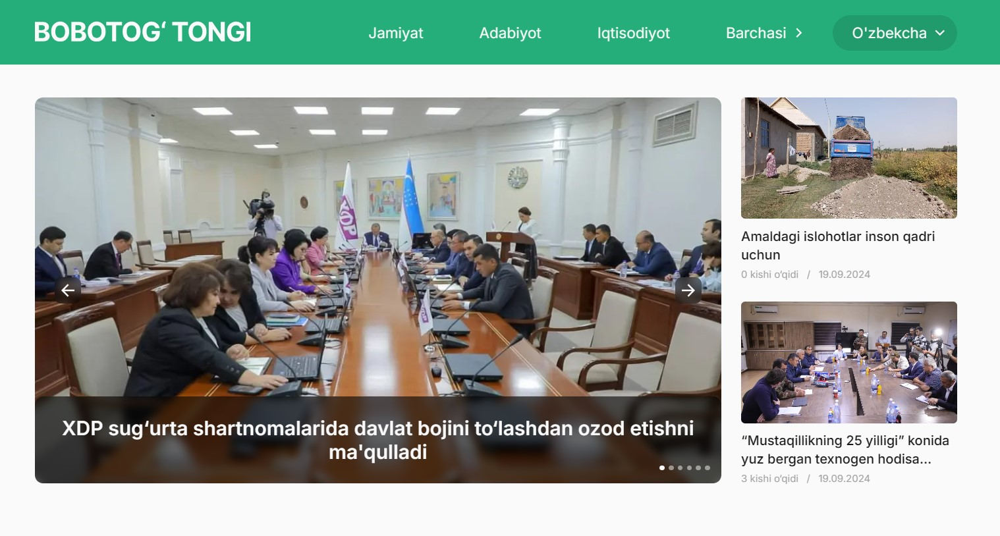

# Bobotog Newspaper

**What it is:**

This is a newspaper web application that shares you daily hot news. Just select an article you are interested in and dive in. All articles split by categories for to find specific article easily and actual articles on the right sidebar. Application works on two language mode(Uzbek latin and cyrillic). There is a newspaper issues page where you can read and download pdf file of newspaper issue.

**Installation:**
To build, download the files from the repository and install the dependencies use npm: npm install. After that, type 'npm run dev' in console to run application in development mode, or 'npm run build' to get built bundle (appears in dist folder).

**Deployed version:** You can find [here](https://newspaper-hazel.vercel.app/).

**Technologies:** React, Next.js, Redux, SASS, Eslint 

**Technical features:**
Adaptive layout, application works equally well on desktops, tablets and mobile devices, fully responsive.
The provided layout is designed cross-browser. Browser requirements met: Chrome, Safari, Firefox latest versions.
The Search Engine Optimization (SEO) approach is used next-sitemap. 